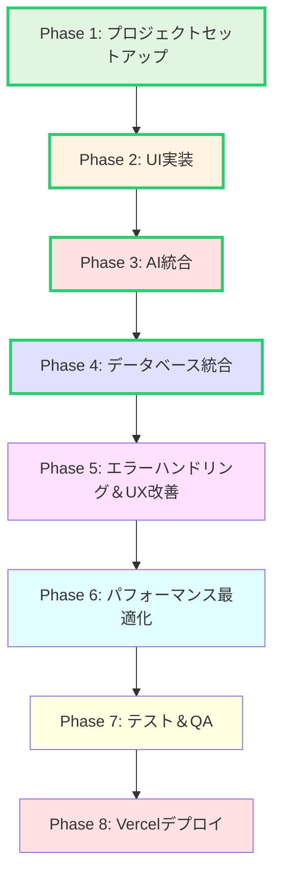
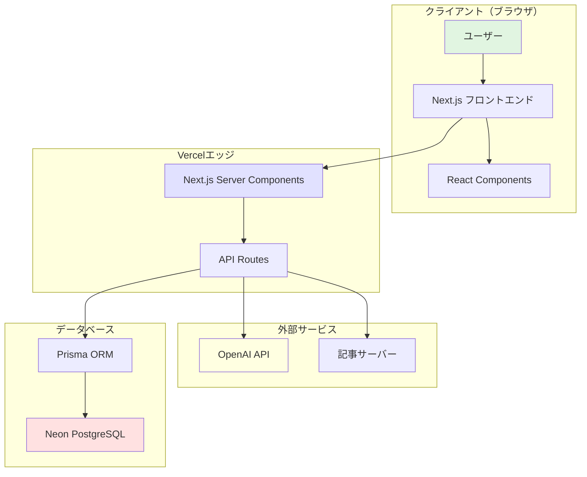
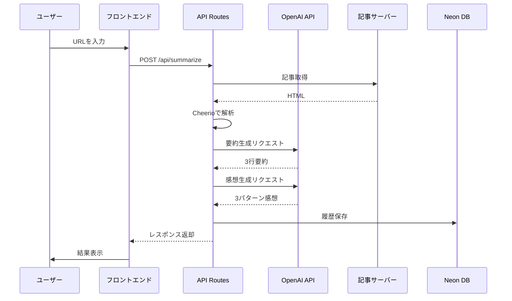

# AIパパっと要約 & 感想ジェネレーター プロジェクト全体概要

**作成日**: 2025年10月23日
**ドキュメントバージョン**: 1.0
**対象者**: 開発者、プロジェクトマネージャー

---

## 目次

1. [プロジェクト概要](#プロジェクト概要)
2. [ビジョンと目的](#ビジョンと目的)
3. [開発方針と設計思想](#開発方針と設計思想)
4. [技術スタック詳細解説](#技術スタック詳細解説)
5. [全Phase一覧とフローチャート](#全phase一覧とフローチャート)
6. [開発スケジュール見積もり](#開発スケジュール見積もり)
7. [リスク管理マトリクス](#リスク管理マトリクス)
8. [チーム体制](#チーム体制)
9. [成功基準（KPI）](#成功基準kpi)
10. [アーキテクチャ図](#アーキテクチャ図)

---

## プロジェクト概要

### プロジェクト名
**AIパパっと要約 & 感想ジェネレーター**

### エグゼクティブサマリー

AIパパっと要約 & 感想ジェネレーターは、ニュース記事やブログのURLをペーストするだけで、AIが即座に3行で要約し、さらに「SNS投稿用の感想コメント」の候補を3パターン生成するWebアプリケーションです。

情報過多の時代において、タイパ(タイムパフォーマンス)を重視するユーザーに向けて、記事の本質を素早く理解し、自分の意見をSNSで発信するハードルを下げることを目的としています。

### プロジェクトの背景

近年、情報過多により効率的な情報収集が求められています。また、SNSでの情報発信が一般化する中、「記事は読めても、自分の意見を言語化するのが苦手」という課題があります。

本プロジェクトは、以下の課題を解決します:
- **タイパニーズ**: 大量の記事を効率的に把握したい
- **SNS投稿のハードル**: 適切な表現やコメントを考える時間がない
- **デモのしやすさ**: 交流会や商談で即座に価値を実感してもらえる
- **カスタマイズ案件への展開**: 企業の社内ポータルやオウンドメディアへの組み込み

---

## ビジョンと目的

### ビジョン

> 「情報過多時代のタイパ革命」
>
> 記事の本質を瞬時に理解し、自分の意見を効果的に発信できる環境を提供します。

### プロジェクトの目的

1. **情報収集の効率化**
   - 記事の本質を3行で理解
   - 重要ポイントの自動抽出
   - 時間効率の最大化

2. **SNS発信のハードルを下げる**
   - 感想コメントの自動生成
   - 複数パターンの提示
   - コピー&ペーストで即座に使用可能

3. **ビジネス展開の基盤**
   - デモのしやすさ
   - カスタマイズ案件への展開
   - 企業向けソリューションの可能性

### ターゲットユーザー

| ユーザー層 | ニーズ | 利用シーン |
|-----------|--------|-----------|
| **ビジネスパーソン** | 大量の記事を効率的にチェックしたい | 日々の情報収集、業界動向把握 |
| **SNSアクティブユーザー** | 記事をシェアしたいが、コメントを考えるのが苦手 | Twitter、Facebook、LinkedInでの情報発信 |
| **マーケティング担当者** | 競合リサーチや情報収集を効率化したい | 日常的な競合分析、トレンド調査 |
| **ブロガー・ライター** | リサーチを効率化したい | 記事執筆前のリサーチ、情報収集 |

---

## 開発方針と設計思想

### コア原則

#### 1. シンプルさの追求（KISS原則）
- **最小限の機能**: URL入力、要約、感想生成に特化
- **直感的操作**: 説明不要のシンプルなUI
- **高速レスポンス**: ユーザーを待たせない

#### 2. モバイルファースト
- **スマホユーザー優先**: タップ操作に最適化
- **レスポンシブデザイン**: 全デバイス対応
- **軽量設計**: モバイル回線でも高速

#### 3. デモのしやすさ
- **即座に価値を実感**: その場でURLをペーストして体験
- **インパクト**: 「すごい」と思わせる即効性
- **口コミで広がる**: SNSシェアしやすい

#### 4. 拡張性の確保
- **カスタマイズ対応**: 企業向けカスタマイズを想定
- **API設計**: 将来的なAPI提供を考慮
- **モジュラー設計**: 機能追加が容易

### 技術的制約と意図的な省略

本MVP（最小実行可能製品）では、以下の機能を**意図的にスコープ外**としています:

| 省略機能 | 理由 | 将来の拡張可能性 |
|---------|------|----------------|
| ユーザー認証 | 誰でもアクセス可能にするため | Phase 9以降で追加検討 |
| 複数言語対応 | 日本語に特化 | Phase 10で追加 |
| PDF・動画要約 | Web記事に限定 | Phase 11で検討 |
| リアルタイム共同編集 | 個人利用を想定 | Phase 12で検討 |

---

## 技術スタック詳細解説

### フロントエンド技術

#### Next.js 15（App Router）

**選定理由:**
- **Server Components**: 初回ロードの高速化、SEO最適化
- **File-based Routing**: 直感的なルーティング設定
- **API Routes統合**: フロントエンドとバックエンドの統一環境
- **Vercel最適化**: デプロイの簡素化

**主要機能の活用:**
```typescript
// app/page.tsx (Server Component)
export default async function HomePage() {
  return <HomePage />;
}

// components/UrlInputForm.tsx (Client Component)
'use client';
export function UrlInputForm() {
  const [url, setUrl] = useState('');
  // クライアントサイドのインタラクティブな操作
}
```

#### TypeScript 5+

**選定理由:**
- **型安全性**: コンパイル時のエラー検出
- **開発者体験**: IntelliSenseによる補完
- **リファクタリング容易性**: 型情報による安全な変更

**型システム設計方針:**
```typescript
// types/api.ts
export interface SummaryRequest {
  url: string;
  options?: {
    summaryLength?: number;
    commentCount?: number;
    tone?: 'casual' | 'formal' | 'neutral';
  };
}

export interface SummaryResponse {
  success: true;
  data: {
    article: ArticleMetadata;
    summary: SummaryData;
    comments: CommentData[];
    metadata: GenerationMetadata;
  };
}
```

#### Tailwind CSS 3+

**選定理由:**
- **高速開発**: ユーティリティクラスによる迅速なスタイリング
- **一貫性**: デザインシステムの統一
- **バンドルサイズ最適化**: 使用されたクラスのみ出力
- **レスポンシブ対応**: モバイルファーストのブレークポイント

### バックエンド・AI技術

#### OpenAI API (GPT-4)

**選定理由:**
- **高精度な要約**: GPT-4の優れた理解力
- **日本語対応**: 高品質な日本語生成
- **ストリーミング対応**: リアルタイムレスポンス
- **安定性**: 商用利用可能

**API統合パターン:**
```typescript
// lib/ai.ts
import OpenAI from 'openai';

export async function generateSummary(content: string) {
  const completion = await openai.chat.completions.create({
    model: 'gpt-4',
    messages: [
      { role: 'system', content: SUMMARY_SYSTEM_PROMPT },
      { role: 'user', content: `記事本文: ${content}` }
    ],
    temperature: 0.7,
  });

  return parseSummaryResponse(completion);
}
```

#### Cheerio（Web Scraping）

**選定理由:**
- **軽量**: サーバーサイドでのHTML解析
- **柔軟性**: jQueryライクなセレクタ
- **高速**: Puppeteerより軽量

### データベース技術

#### Neon PostgreSQL

**選定理由:**
- **サーバーレス**: 使用量に応じた自動スケーリング
- **無料枠**: 0.5GBストレージ、十分な開発・プロトタイプ用途
- **低レイテンシ**: エッジネットワーク対応
- **Vercel親和性**: シームレスな統合

#### Prisma ORM

**選定理由:**
- **型安全性**: TypeScriptとの完全統合
- **マイグレーション**: シンプルなスキーマ管理
- **開発者体験**: Prisma Studioによる可視化

### デプロイ・インフラ

#### Vercel

**選定理由:**
- **Next.js最適化**: 開発元による完全サポート
- **自動CI/CD**: GitHubプッシュで自動デプロイ
- **エッジネットワーク**: グローバルCDN
- **無料枠**: 個人プロジェクトに十分

---

## 全Phase一覧とフローチャート

### Phase概要

プロジェクトは8のPhaseに分割され、段階的に機能を実装します。Phase 1-4が**MVP（Minimum Viable Product）**として最優先で開発され、Phase 5-8は品質向上とデプロイに焦点を当てます。

### Phase詳細

#### Phase 1: プロジェクトセットアップ（時間見積: 2時間）

**目的:** 開発環境の構築とベース設定

**タスク:**
1. 依存関係のインストール
2. 環境変数の設定（.env.local）
3. Neon PostgreSQL接続確認
4. Prismaセットアップ（generate, migrate, seed）
5. 開発サーバー起動確認

**成果物:**
- 動作するNext.js開発サーバー
- データベース接続完了
- Git履歴の初期化

**詳細ドキュメント:** `20251023_01-project-setup.md`

---

#### Phase 2: UI実装（時間見積: 4時間）

**目的:** ユーザーインターフェースの構築

**タスク:**
1. ランディングページ実装（`app/page.tsx`）
2. URL入力フォームコンポーネント（`components/UrlInputForm.tsx`）
3. 結果表示コンポーネント（`components/SummaryDisplay.tsx`、`components/CommentCard.tsx`）
4. レスポンシブデザイン対応
5. Tailwind CSSスタイリング

**成果物:**
- 完全なUI画面
- スマホ・PC両対応

**詳細ドキュメント:** `20251023_02-ui-implementation.md`

---

#### Phase 3: AI統合（時間見積: 5時間）

**目的:** AI機能の実装と統合

**タスク:**
1. 記事取得機能実装（`lib/scraper.ts`）
2. OpenAI API統合（`lib/ai.ts`）
3. 要約生成API実装（`app/api/summarize/route.ts`）
4. 感想コメント生成（3パターン）
5. エラーハンドリング
6. プロンプトエンジニアリング

**成果物:**
- 動作する要約・感想生成機能
- エラーハンドリング完備

**詳細ドキュメント:** `20251023_03-ai-integration.md`

---

#### Phase 4: データベース統合（時間見積: 3時間）

**目的:** データベースとの連携

**タスク:**
1. 履歴保存機能実装
2. 履歴取得API実装（`app/api/history/route.ts`）
3. 履歴削除機能
4. 統計情報収集
5. Prismaクエリ最適化

**成果物:**
- 履歴保存・取得機能
- 統計情報の収集

**詳細ドキュメント:** `20251023_04-database-integration.md`

---

#### Phase 5: エラーハンドリング＆UX改善（時間見積: 3時間）

**目的:** ユーザー体験の向上

**タスク:**
1. 包括的エラーハンドリング
2. ローディング状態の最適化
3. トーストメッセージ実装
4. マイクロインタラクション追加
5. バリデーション強化

**成果物:**
- 洗練されたUX
- エラーメッセージの改善

**詳細ドキュメント:** `20251023_05-error-handling-ux.md`

---

#### Phase 6: パフォーマンス最適化（時間見積: 2時間）

**目的:** アプリケーションの高速化

**タスク:**
1. バンドルサイズ最適化
2. 画像最適化
3. レンダリング最適化
4. Lighthouse スコア90以上達成
5. コード分割

**成果物:**
- Lighthouse スコア90以上
- 高速なページロード

**詳細ドキュメント:** `20251023_06-performance-optimization.md`

---

#### Phase 7: テスト＆QA（時間見積: 3時間）

**目的:** 品質保証

**タスク:**
1. 機能テスト実施
2. クロスブラウザテスト
3. デバイステスト（スマホ・タブレット・PC）
4. セキュリティチェック
5. バグフィックス

**成果物:**
- テストレポート
- バグ修正完了

**詳細ドキュメント:** `20251023_07-testing-qa.md`

---

#### Phase 8: Vercelデプロイ＆プレリリース（時間見積: 2時間）

**目的:** 本番環境へのデプロイ

**タスク:**
1. Vercelプロジェクトセットアップ
2. 環境変数設定（Vercel）
3. 本番デプロイ
4. 本番環境動作確認
5. ドメイン設定（オプション）

**成果物:**
- 本番環境で動作するアプリケーション
- 公開URL

**詳細ドキュメント:** `20251023_08-deployment.md`

---

### Phase間の依存関係フローチャート



**凡例:**
- 緑色: セットアップ（Phase 1）
- 黄色: UI実装（Phase 2）
- 赤色: AI統合（Phase 3）
- 青色: データベース統合（Phase 4）
- 紫色: UX改善（Phase 5）
- 水色: パフォーマンス最適化（Phase 6）
- クリーム色: テスト（Phase 7）
- 赤色: デプロイ（Phase 8）

---

## 開発スケジュール見積もり

### 総見積時間: 24時間

### タスクブレイクダウン（累計時間）

| Phase | タスク | 見積時間 | 累計 |
|-------|--------|---------|------|
| **Phase 1** | プロジェクトセットアップ | 2時間 | 2時間 |
| **Phase 2** | UI実装 | 4時間 | 6時間 |
| **Phase 3** | AI統合 | 5時間 | 11時間 |
| **Phase 4** | データベース統合 | 3時間 | 14時間 |
| **Phase 5** | エラーハンドリング＆UX改善 | 3時間 | 17時間 |
| **Phase 6** | パフォーマンス最適化 | 2時間 | 19時間 |
| **Phase 7** | テスト＆QA | 3時間 | 22時間 |
| **Phase 8** | Vercelデプロイ | 2時間 | **24時間** |

### 開発モデル: アジャイルスプリント

**スプリント構成:**
- **Sprint 1（14時間）**: Phase 1-4（MVP開発）
- **Sprint 2（10時間）**: Phase 5-8（品質向上・デプロイ）

**デイリーチェックポイント:**
- 毎日の終了時に動作確認
- Gitコミット（意味のある単位）
- 次の日の作業計画立案

### バッファ時間

予期しない問題に備えて、総見積時間の20%（約5時間）をバッファとして確保:

**合計開発時間: 24時間 + 5時間バッファ = 約29時間**

**実稼働日数見積:**
- **集中開発**: 3-4日（1日8時間作業）
- **通常ペース**: 7-9日（1日3-4時間作業）

---

## リスク管理マトリクス

### リスク評価基準

**影響度:**
- 高: プロジェクト完成に致命的
- 中: 機能制限が発生
- 低: 軽微な影響

**発生確率:**
- 高: 50%以上
- 中: 20-50%
- 低: 20%未満

### リスク一覧

| ID | リスク項目 | 影響度 | 確率 | リスクレベル | 軽減策 | 対応策 |
|----|-----------|-------|------|------------|--------|--------|
| R1 | OpenAI API料金超過 | 中 | 中 | 中 | レート制限実装、使用量監視 | トークン制限、キャッシング |
| R2 | 記事取得失敗 | 中 | 中 | 中 | エラーハンドリング、リトライロジック | 複数スクレイピング手法 |
| R3 | Neon無料枠の制限超過 | 中 | 低 | 低 | データ量監視、最適化 | 有料プランへのアップグレード |
| R4 | パフォーマンス問題 | 中 | 中 | 中 | React.memoの使用、最適化 | パフォーマンスプロファイリング |
| R5 | セキュリティ脆弱性（XSS等） | 高 | 中 | 高 | サニタイゼーション実装 | セキュリティ監査、ライブラリ更新 |
| R6 | Vercelデプロイエラー | 高 | 低 | 中 | ローカルで`npm run build`テスト | ビルドログ確認、環境変数確認 |
| R7 | スコープクリープ | 中 | 高 | 高 | 厳格なPhase管理 | Phase 9以降を後回し |

---

## チーム体制

### プロジェクト構成

本プロジェクトは、**1名のプロジェクトマネージャー（PM）+ AIエージェント**による開発体制です。

### 役割定義

#### プロジェクトマネージャー（あなた）

**責任範囲:**
- プロジェクト全体の意思決定
- Phase進行の管理
- 最終的なコード品質の確認
- デザイン判断
- デプロイ実行

**作業内容:**
- ドキュメント確認
- コードレビュー
- バグテスト
- UI/UX検証

#### AIエージェント（Claude）

**責任範囲:**
- コード実装
- ドキュメント作成
- 技術調査
- ベストプラクティス提案

**作業内容:**
- TypeScriptコードの生成
- 設定ファイルの作成
- バグ修正の提案
- パフォーマンス最適化の提案

---

## 成功基準（KPI）

### 技術的KPI

| 指標 | 目標値 | 測定方法 |
|------|--------|---------|
| **ビルド成功率** | 100% | `npm run build`の成功 |
| **TypeScript型エラー** | 0件 | `npm run type-check` |
| **Lighthouse Performance** | 90点以上 | Lighthouse CI |
| **Lighthouse Accessibility** | 95点以上 | Lighthouse CI |
| **初回ロード時間** | 2秒以下 | Chrome DevTools |
| **AI要約生成時間** | 5秒以内 | APIレスポンスタイム |

### 機能的KPI

| 機能 | 成功基準 |
|------|---------|
| **URL入力** | あらゆる形式のURLに対応 |
| **要約生成** | 3行で簡潔に要約 |
| **感想生成** | 3パターンの異なる視点 |
| **履歴保存** | 100%の確率で保存成功 |
| **クロスブラウザ** | Chrome, Firefox, Safari, Edgeで動作 |

### ユーザー体験KPI

| 指標 | 目標 |
|------|------|
| **初回利用での理解** | 説明なしで操作可能 |
| **要約生成までの時間** | 5秒以内 |
| **エラーメッセージの明確性** | 原因と対処法が明示 |
| **レスポンシブ対応** | スマホでも快適に操作可能 |

---

## アーキテクチャ図

### システム全体構成図



### データフロー図



---

## 次のステップ

### 今すぐ開始

1. **Phase 1ドキュメントを確認**
   - `20251023_01-project-setup.md`を開く
   - プロジェクトセットアップ手順に従う

2. **開発環境の準備**
   - Node.js 18.x以上をインストール
   - VSCodeまたは好みのエディタを準備

3. **APIキーの取得**
   - OpenAI APIキーを取得
   - Neonアカウント作成とデータベース作成

---

## まとめ

AIパパっと要約 & 感想ジェネレータープロジェクトは、8のPhaseに分かれた体系的な開発計画により、約24-29時間で完成予定です。Next.js 15、TypeScript、OpenAI API、Neon PostgreSQLといった最新技術スタックを活用し、タイパ重視のユーザーに価値を提供するWebアプリケーションを実現します。

段階的な開発アプローチにより、各Phaseで明確な成果物を生み出し、最終的にはVercelで公開される完全なWebアプリケーションとなります。

**次のドキュメント:** `20251023_01-project-setup.md`（プロジェクトセットアップ詳細手順）

---

**ドキュメント作成者**: AI Agent (Claude)
**最終更新日**: 2025年10月23日
**バージョン**: 1.0
